# Lähdeluettelo

!!! tip

    Tämä dokumentaatio ja [Viitteet](viitteet.md)-dokumentaatio ovat sisarukset. Tässä käsitellään BibLaTex-tiedoston (`references.bib`) määrittely eri lähdetyypeille. Viitteet-dokumentaatiossa käsitellään sitä, miten viitteet lisätään tekstin sisälle.

## Lähdeluettelon luominen

Lähdeluettelo elää `references.bib`-tiedostossa. Lähteet tässä tiedostossa ovat BibLaTeX-muodossa. Typst lukee tämän tiedoston sisäänsä ja yhdistää sen `kamk-thesis`-mallipohjan mukana tuleviin sääntöihin (`kamk-vancouver.csl`), jolloin lähdeluettelo muodostuu automaattisesti. Tämä prosessi on helpompi näyttää videolla kuin kuvata tekstinä, joten varsinainen putki `Lähdeteos -> Zotero -> BibLaTeX -> Typst` esitellään videolla, jossa käsitellään tämän dokumentaatiosivuston sisältö.

<div class="grid" markdown>

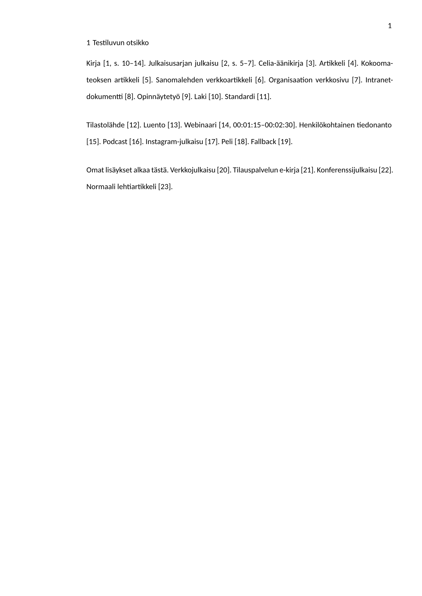
{ .card }

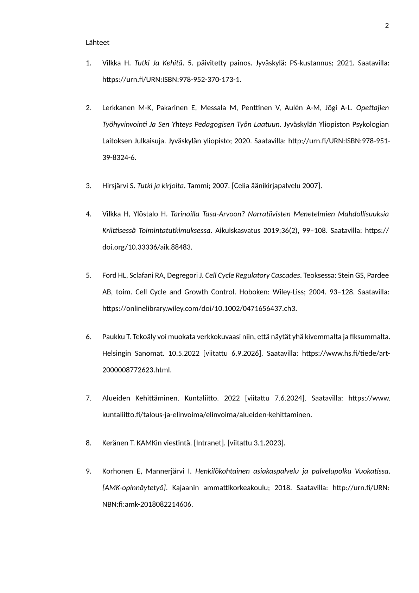
{ .card }

</div>

**Kuva 1:** _Tässä diptyykissä on vierekkäin opinnäytetyön tekstiluvun sisäiset viitteet (vasen kuva) ja näistä automaattisesti generoidun lähdeluettelon ensimmäinen sivu (oikealla). Klikkaa kuvat auki suuremmaksi._

Alla on lyhyt lista, jota voit käyttää ohjenuorana siinä, miten lähteet kannattaa syöttää Zoteroon. Osa opinnäytetyön (tai muun raportin) kirjoittamisen prosessia on oppia, mistä tietoa löytyy ja miten siihen viitataan. Tämä on siis lopulta sinun vastuullasi. Alla kuitenkin ohjenuora:

- Jos teoksella on ISBN- tai DOI-numero, syötä se Zoteroon. Zotero pyrkii hakemaan tiedot automaattisesti.
- ...tai jos teoksella ei ole ISBN- tai DOI-numero, mutta lähde on digitaalinen, etsi onko sivustolla _"Cite This"_ tai _"Export to Zotero"_ tai _"Export BibTeX"_ näppäin.
- ...tai jos yllä olevat eivät täsmänneet, mutta lähde on digitaalinen, kokeile **Zotero Connect** -selainlaajennusta. Se löytää ainakin osan kentistä ja täyttää ne oikein.
- ...lopulta, jos lähde on jokin muu, kuten haastattelu, luento, sähköposti tai muu henkilökohtainen tiedonanto, syötä lähteen tiedot Zoteroon käsin.

Kaikissa näissä tapauksissa sinun tulee tarkistaa, että tarvittavat tiedot ovat täytettynä Zoterossa. Zotero sen sijaan osaa muodostaa `.bib`-tiedoston sinun puolestasi. Lähtökohtaisesti sinun ei siis tarvitse koskaan muokata `references.bib`-tiedostoa käsin, jos käytät Zoteroa. Jos et jostain syystä halua käyttää Zoteroa, saat toki kirjoittaa BibLaTeX-lähteet käsin. Eli siis: ==jos tiedot eivät ole täydelliset, täydennä ne itse.== Kirjojen osalta nimiösivu on hyvä lähde. Muiden lähteiden osalta saatat joutua tekemään salapoliisityötä.

## BibLaTeX-formaatti

Typstillä on oma Hayagrive YAML -lähdeformaatti, mutta ainakaan 2026 Zotero ei osaa kirjoittaa sitä ulos. Siksi käytämme sen edeltäjää, LaTeX-ekosysteemistä tuttua BibLaTeX-formaattia. Tässä dokumentissa ei käydä läpi BibLaTeX-formaatin kaikkia mahdollisuuksia, vaan keskitytään niihin kenttiin, joita `kamk-vancouver.csl` käyttää lähdeluettelomerkinnän muodostamiseen.

Formaatti on muotoa, jossa seuraavanlaisia entryjä on useita peräkkäin `.bib`-tiedostossa:

```plaintext
@<lähdetyyppi>{<tunniste>,
    <kenttä> = {<arvo>},
    <kenttä> = {<arvo>},
    ...
}
```

Tunniste on yksilöivä ID, jonka sinä (tai Zotero) päätät itse. Se on usein muotoa `sukunimiLyhytOtsikko2026`, mutta tämä on vain konventio. Vältä kuitenkin erikoismerkkejä.

!!! warning

    BibLaTeX-formaatti on tarkka. Jos esimerkiksi sulut eivät täsmää, Typst ei osaa lukea lähdeluetteloa. Siksi on suositeltavaa käyttää Zoteroa, joka osaa kirjoittaa BibLaTeX-tiedoston oikein.

## Kirjaston lähteet

Tässä dokumentissa kuvataan lähdetyypeittäin ne kentät, joita `kamk-vancouver.csl` käyttää lähdeluettelomerkinnän muodostamiseen. Valinnaiset kentät ovat merkitty `(opt)`-merkinnällä. Valinnaisuuden ehto on yleensä se, että onko kyseinen tieto olemassa. Tyypillisesti tässä on kyse siitä, että onko ko. lähteellä olevassa esimerkiksi URL-osoitetta tai DOI-numeroa. Ohje on laadittu käyttäen KAMK:n kirjaston [Vancouver: Lähdeviitteet ja lähdeluettelo](https://libguides.kamk.fi/vancouver)-ohjetta referenssinä. Tavoite on toisintaa esimerkin lähdeviitteet Typst:n avulla; alkuperäinen ohje on tarkoitettu Wordille.

!!! tip

    Huomaa, että BibLaTeX-tiedostossa voi olla kenttiä, joita ei alla mainita. Esimerkiksi `abstract`- tai `ISBN`-kenttä voi tulla lähteen mukana, mutta se ei vaikuta lähdeluettelon muodostamiseen. Toisin sanoen CSL-tiedoston sääntöjen mukaan lähdeluettelosta poimitaan alla mainitut kentät; ei muuta.

### 1. Kirja ja e-kirja

Zoteron lähdetyyppi: **Book**

Painettu kirja ja e-kirja käsitellään samalla lähdetyypillä. Verkossa julkaistulle kirjalle voidaan lisäksi tallentaa pysyvä URL-osoite.

| BibLaTeX-kenttä  | Esimerkkiarvo                               | Kentän nimi Zoterossa |
| ---------------- | ------------------------------------------- | --------------------- |
| `author`         | `Vilkka, Hanna`                             | Author                |
| `title`          | `Tutki ja kehitä`                           | Title                 |
| `date`           | `2021`                                      | Date                  |
| `publisher`      | `PS-kustannus`                              | Publisher             |
| `location` (opt) | `Jyväskylä`                                 | Place                 |
| `edition` (opt)  | `5. päivitetty painos`                      | Edition               |
| `url` (opt)      | `https://urn.fi/URN:ISBN:978-952-370-173-1` | URL                   |

Lähdeluettelossa se näyttää tältä:

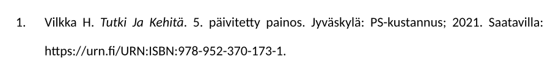

??? info "BibLaTeX entry"

    ```bibtex
    @book{vilkkaTutkiJaKehita2021,
        title = {Tutki Ja Kehitä},
        author = {Vilkka, Hanna},
        date = {2021},
        edition = {5. päivitetty painos},
        publisher = {PS-kustannus},
        location = {Jyväskylä},
        url = {https://urn.fi/URN:ISBN:978-952-370-173-1},
        abstract = {Tutki ja kehitä on perusteos ...},
        isbn = {978-952-370-173-1}
    }
    ```

### 2. Julkaisusarja julkaistu kirja

Zoteron lähdetyyppi: **Book**

Julkaisusarjassa julkaistu kirja käsitellään pääasiassa kuten mikä tahansa kirja. Tavallisen kirjan lisäksi tallennetaan sarjan nimi ja sarjan numero. Jos sarja on sinulle entuudestaan tuntematon käsite, sillä tarkoitetaan sellaista julkaisua, joka julkaistaan tyypillisesti jonkin organisaation toimesta toistuvana sarjana julkaisuja. Esimerkiksi KAMK:lla on muutama oma julkaisusarja. Voit etsiä näihin kuuluvia kirjoja KAMK Finna -palvelusta hakusanalla _"Kajaanin ammattikorkeakoulun julkaisusarja"_. Myös esimerkiksi Aalto-yliopistolla on julkaisusarjoja.

| BibLaTeX-kenttä | Esimerkkiarvo                                                                                                       | Kentän nimi Zoterossa |
| --------------- | ------------------------------------------------------------------------------------------------------------------- | --------------------- |
| `author`        | `Lerkkanen, Marja-Kristiina; Pakarinen, Eija; Messala, Maiju; Penttinen, Viola; Aulén, Anna-Mari; Jõgi, Anna-Liisa` | Author                |
| `title`         | `Opettajien työhyvinvointi ja sen yhteys pedagogisen työn laatuun`                                                  | Title                 |
| `date`          | `2020`                                                                                                              | Date                  |
| `publisher`     | `Jyväskylän yliopisto`                                                                                              | Publisher             |
| `series`        | `Jyväskylän yliopiston psykologian laitoksen julkaisuja`                                                            | Series                |
| `number` (opt)  | `358`                                                                                                               | Series Number         |
| `url` (opt)     | `http://urn.fi/URN:ISBN:978-951-39-8324-6`                                                                          | URL                   |

Lähdeluettelossa se näyttää tältä:

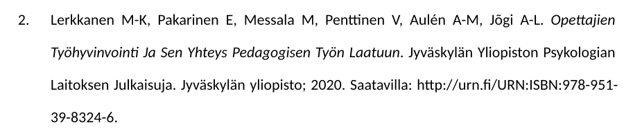

??? info "BibLaTeX entry"

    ```bibtex
    @book{lerkkanenOpettajienTyohyvinvointiJa2020,
        title = {Opettajien Työhyvinvointi Ja Sen Yhteys Pedagogisen Työn Laatuun},
        author = {Lerkkanen, Marja-Kristiina and Pakarinen, Eija and Messala, Maiju and Penttinen, Viola and Aulén, Anna-Mari and Jõgi, Anna-Liisa},
        date = {2020},
        series = {Jyväskylän Yliopiston Psykologian Laitoksen Julkaisuja},
        number = {358},
        publisher = {Jyväskylän yliopisto},
        url = {http://urn.fi/URN:ISBN:978-951-39-8324-6},
        abstract = {The aim of the study ...},
        isbn = {978-951-39-8324-6, 0782-3274}
    }
    ```

### 3. Celian äänikirja

Zoteron lähdetyyppi: **Book**

Celian äänikirja tallennetaan kirjana. Celia-palvelua koskeva tieto lisätään huomautukseen.

| BibLaTeX-kenttä | Esimerkkiarvo                   | Kentän nimi Zoterossa |
| --------------- | ------------------------------- | --------------------- |
| `author`        | `Hirsjärvi, Sirkka`             | Author                |
| `title`         | `Tutki ja kirjoita`             | Title                 |
| `date`          | `2007`                          | Date                  |
| `publisher`     | `Tammi`                         | Publisher             |
| `medium`        | `audio`                         |                       |
| `note`          | `[Celia äänikirjapalvelu 2007]` | Notes                 |

Lähdeluettelossa se näyttää tältä:

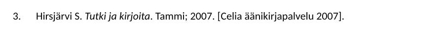

??? info "BibLaTeX entry"

    ```bibtex
    @book{hirsjarviTutki2007,
        title = {Tutki ja kirjoita},
        author = {Hirsjärvi, Sirkka},
        date = {2007},
        publisher = {Tammi},
        howpublished = {audio},
        note = {[Celia äänikirjapalvelu 2007]}
    }
    ```

### 4. Tieteellinen artikkeli

Zoteron lähdetyyppi: **Journal Article**. Moderneista artikkeleista löytyy lähes poikkeuksetta DOI-numero, jota hyödyntäen saat Zoteroon tiedot, jotka ovat usein oikeat. Käy ne kuitenkin läpi; kenties sivunumero puuttuu, vaikka se mainitaan alkuperäisessä tietokannassa, josta artikkelin löysit. Suosi URL:lssa nimenomaan pysyvää osoitetta, kuten `https://doi.org/...` tai `https://urn.fi/URN:...`. Älä käytä URL-osoitetta, joka on esimerkiksi tietokannan sisäinen hakuosoite.

| BibLaTeX-kenttä | Esimerkkiarvo                                                                                           | Kentän nimi Zoterossa |
| --------------- | ------------------------------------------------------------------------------------------------------- | --------------------- |
| `author`        | `Vilkka, Hanna; Ylöstalo, Hanna`                                                                        | Author                |
| `title`         | `Tarinoilla tasa-arvoon? Narratiivisten menetelmien mahdollisuuksia kriittisessä toimintatutkimuksessa` | Title                 |
| `date`          | `2019-12-18`                                                                                            | Date                  |
| `journaltitle`  | `Aikuiskasvatus`                                                                                        | Publication           |
| `volume` (opt)  | `36`                                                                                                    | Volume                |
| `number` (opt)  | `2`                                                                                                     | Issue                 |
| `pages` (opt)   | `99–108`                                                                                                | Pages                 |
| `url` (opt)     | `https://doi.org/10.33336/aik.88483`                                                                    | URL                   |

Lähdeluettelossa se näyttää tältä:

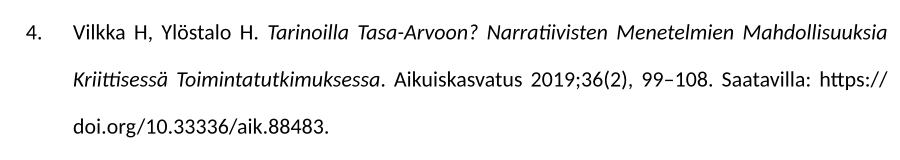

??? info "BibLaTeX entry"

    ```bibtex
    @article{vilkkaTarinoillaTasaarvoon2019,
        title = {Tarinoilla Tasa-Arvoon? {{Narratiivisten}} Menetelmien Mahdollisuuksia Kriittisessä Toimintatutkimuksessa},
        author = {Vilkka, Hanna and Ylöstalo, Hanna},
        date = {2019-12-18},
        journaltitle = {Aikuiskasvatus},
        shortjournal = {AK},
        volume = {36},
        number = {2},
        pages = {99--108},
        issn = {2490-0427, 0358-6197},
        doi = {10.33336/aik.88483},
        url = {https://doi.org/10.33336/aik.88483},
        abstract = {Artikkelimme on teoreettis....}
    }
    ```

### 5. Kokoomateoksen artikkeli tai kirjan luku

Zoteron lähdetyyppi: **Book Section**. Jos tämä kirjoitusmuoto on sinulle entuudestaan tuntematon, kyseessä on kirjan luku, joka on julkaistu osana kokoomateosta. Kokoomateos on kirja, jossa on useita eri kirjoittajien kirjoittamia lukuja. Esimerkki olkoon KAMK:n oma teos _cKAMK: opetus on yhteyksien luomista, luovuutta ja valmentamista_ vuodelta 2018. Se kuuluu **kokonaisuutena** julkaisusarjaan, mutta jos viittaat yhteen lukuun, on kyseinen luku yksittäinen kokoomateoksen luku. Jos seuraat urlia [https://urn.fi/URN:ISBN:978-952-7219-35-5](https://urn.fi/URN:ISBN:978-952-7219-35-5) ja avaat PDF-tiedoston, huomaat, että eri luvut ovat kirjoittaneet eri kirjoittajat.

Jos teoksella on toimittaja, se ilmoitetaan `editor`-kentässä. Kaikilla kokoomateoksilla on kirjoittajia, mutta ei välttämättä toimittajia.

| BibLaTeX-kenttä  | Esimerkkiarvo                                                | Kentän nimi Zoterossa |
| ---------------- | ------------------------------------------------------------ | --------------------- |
| `author`         | `Ford, Heide L.; Sclafani, Robert A.; Degregori, James`      | Author                |
| `title`          | `Cell Cycle Regulatory Cascades`                             | Title                 |
| `booktitle`      | `Cell Cycle and Growth Control`                              | Book Title            |
| `editor` (opt)   | `Stein, Gary S.; Pardee, Arthur B.`                          | Editor                |
| `date`           | `2004-05-10`                                                 | Date                  |
| `publisher`      | `Wiley-Liss`                                                 | Publisher             |
| `location` (opt) | `Hoboken`                                                    | Place                 |
| `pages`          | `93–128`                                                     | Pages                 |
| `url` (opt)      | `https://onlinelibrary.wiley.com/doi/10.1002/0471656437.ch3` | URL                   |

Lähdeluettelossa se näyttää tältä:

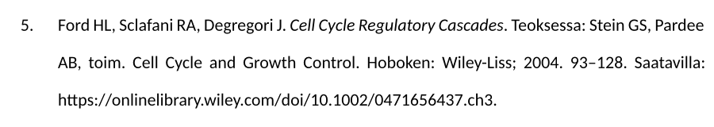

??? info "BibLaTeX entry"

    ```bibtex
    @incollection{fordCellCycleRegulatory2004,
        title = {Cell {{Cycle Regulatory Cascades}}},
        booktitle = {Cell {{Cycle}} and {{Growth Control}}},
        author = {Ford, Heide L. and Sclafani, Robert A. and Degregori, James},
        editor = {Stein, Gary S. and Pardee, Arthur B.},
        date = {2004-05-10},
        edition = {1},
        pages = {93--128},
        publisher = {Wiley-Liss},
        location = {Hoboken},
        doi = {10.1002/0471656437.ch3},
        url = {https://onlinelibrary.wiley.com/doi/10.1002/0471656437.ch3},
        isbn = {978-0-471-25071-5 978-0-471-65643-2},
    }
    ```

### 6. Verkkolehden artikkeli

Zoteron lähdetyyppi: **Web Page**

Verkkolehden artikkeli käsitellään verkkosivuna. Julkaisija ilmoitetaan `publisher`-kentässä. Jos kirjoittaja (tai edes hänen nickname) on tiedossa, se ilmoitetaan `author`-kentässä. Jos kirjoittajaa ei ole, `author`-kenttä voidaan jättää pois. Erityisen tärkeä online-lähteiden kanssa on arvo `urldate`, joka kääntyy lähdeluettelossa **Viitattu**-sanan arvoksi. Online-sisältö muuttuu usein, joten on tärkeää ilmoittaa, milloin lähde on tarkistettu. Zotero täyttää tämän noutohetkellä automaattisesti. Lisäksi Zotero tallentaa sinulle snapshotin sivustosta, joten jos se lakkaa olemasta saatavilla, sinulla on yhä oma paikallinen kopio.

| BibLaTeX-kenttä | Esimerkkiarvo                                                                       | Kentän nimi Zoterossa |
| --------------- | ----------------------------------------------------------------------------------- | --------------------- |
| `author` (opt)  | `Paukku, Timo`                                                                      | Author                |
| `title`         | `Tekoäly voi muokata verkkokuvaasi niin, että näytät yhä kivemmalta ja fiksummalta` | Title                 |
| `date`          | `2022-05-10`                                                                        | Date                  |
| `publisher`     | `Helsingin Sanomat`                                                                 | Publisher             |
| `url`           | `https://www.hs.fi/tiede/art-2000008772623.html`                                    | URL                   |
| `urldate`       | `2026-09-06`                                                                        | Accessed              |

Lähdeluettelossa se näyttää tältä:

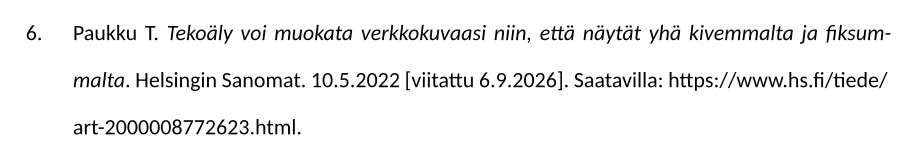

??? info "BibLaTeX entry"

    ```bibtex
    @online{paukkuTekoalyVoiMuokata2022,
        title = {Tekoäly voi muokata verkkokuvaasi niin, että näytät yhä kivemmalta ja fiksummalta},
        author = {Paukku, Timo},
        date = {2022-05-10},
        publisher = {Helsingin Sanomat},
        url = {https://www.hs.fi/tiede/art-2000008772623.html},
        urldate = {2026-09-06},
        abstract = {Algoritmi tekee kuvastasi vetävän, mutta tuo eettisiä ongelmia.},
        langid = {finnish},
    }
    ```

### 7. Organisaation verkkosivu

Zoteron lähdetyyppi: **Web Page**

Jos verkkosivulla ei ole henkilötekijää, `author`-kenttä voidaan jättää pois. Organisaatio ilmoitetaan tällöin julkaisijana. Huomaa, että tämä on käytännössä sama asia kuin yllä oleva; kirjoittaja vain ole tiedossa, ja Hesarin tilalla on Kuntaliitto.

| BibLaTeX-kenttä | Pakollisuus                | Esimerkkiarvo                                                                    | Kentän nimi Zoterossa |
| --------------- | -------------------------- | -------------------------------------------------------------------------------- | --------------------- |
| `title`         | Pakollinen                 | `Alueiden kehittäminen`                                                          | Title                 |
| `date`          | Pakollinen                 | `2022`                                                                           | Date                  |
| `publisher`     | Pakollinen                 | `Kuntaliitto`                                                                    | Publisher             |
| `url`           | Pakollinen                 | `https://www.kuntaliitto.fi/talous-ja-elinvoima/elinvoima/alueiden-kehittaminen` | URL                   |
| `urldate`       | Pakollinen verkkolähteelle | `2024-06-07`                                                                     | Accessed              |

Lähdeluettelossa se näyttää tältä:

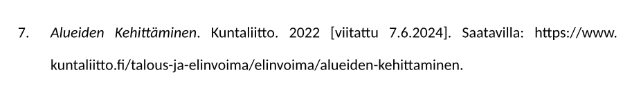

??? info "BibLaTeX entry"

    ```bibtex
    @online{kuntaliittoAlueiden,
        title = {Alueiden Kehittäminen},
        date = {2022},
        publisher = {Kuntaliitto},
        url = {https://www.kuntaliitto.fi/talous-ja-elinvoima/elinvoima/alueiden-kehittaminen},
        urldate = {2024-06-07}
    }
    ```

### 8. Intranet-aineisto

Zoteron lähdetyyppi: **Web Page**. Intranetillä tarkoitetaan yrityksen sisäistä verkkoa, johon ei pääse ulkopuoliset. Intranet-aineisto käsitellään verkkosivuna. Tyypillisesti tähän pääsee käsiksi vain ja ainoastaan yrityksen sisäverkosta tai VPN:n yli, kenties seuraten osoitetta kuten `https://firma.local` tai `https://firma.sharepoint.com`. Se voi olla myös jokin muu sisäisen verkon lähde, kuten jokin vain yrityksen sisällä näkyvä `K:/`-verkkoasema. Se ei ole julkisesti saatavilla. Intranetin URL-osoitetta ei tallenneta, vaikka se olisi tiedossa, koska kellään muulla ei ole siihen pääsyä.

KAMK:n Vancouver -tyyliin kuuluu maininta `[Intranet]`. Tätä Zotero ei lisää automaattisesti vaan se tulee lisätä itse käsin Title-kenttään hakasulkeisiin.

| BibLaTeX-kenttä | Pakollisuus                                          | Esimerkkiarvo                  | Kentän nimi Zoterossa |
| --------------- | ---------------------------------------------------- | ------------------------------ | --------------------- |
| `author`        | Pakollinen, jos tekijä on tiedossa                   | `Keränen, T.`                  | Author                |
| `title`         | Pakollinen                                           | `KAMKin viestintä. [Intranet]` | Title                 |
| `note`          | Pakollinen, jos viittauspäivä annetaan huomautuksena | `[viitattu 3.1.2023]`          | Notes                 |

Lähdeluettelossa se näyttää tältä:

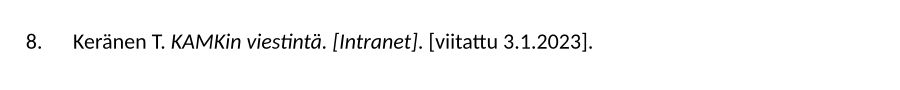

??? info "BibLaTeX entry"

    ```bibtex
    @online{keranenIntranet2023,
        author = {Keränen, T.},
        title = {KAMKin viestintä. [Intranet]},
        note = {[viitattu 3.1.2023]}
    }
    ```

### 9. Opinnäytetyö

Zoteron lähdetyyppi: **Thesis**

Typst ei tue sopivaa tunnistekenttää tietoa `[AMK-opinnäytetyö]` varten, joten se pitää valitettavasti kirjoittaa manuaalisesti Title-kenttään hakasulkeisiin. Zotero ei lisää tätä automaattisesti. Jos kyseessä olisi esimerkiksi väitöskirja, kirjoita sen sijaan `[Väitöskirja]` hakasulkeisiin.

| BibLaTeX-kenttä | Esimerkkiarvo                                                                    | Kentän nimi Zoterossa |
| --------------- | -------------------------------------------------------------------------------- | --------------------- |
| `author`        | `Korhonen, E.; Mannerjärvi, I.`                                                  | Author                |
| `title`         | `Henkilökohtainen asiakaspalvelu ja palvelupolku Vuokatissa. [AMK-opinnäytetyö]` | Title                 |
| `publisher`     | `Kajaanin ammattikorkeakoulu`                                                    | University            |
| `date`          | `2018`                                                                           | Date                  |
| `url`           | `http://urn.fi/URN:NBN:fi:amk-2018082214606`                                     | URL                   |

Lähdeluettelossa se näyttää tältä:

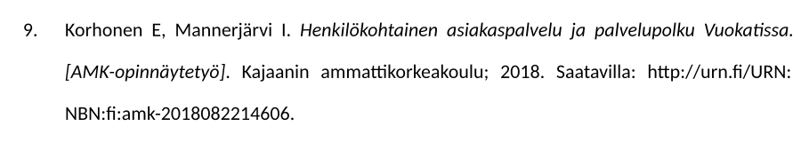

??? info "BibLaTeX entry"

    ```bibtex
    @thesis{korhonenVuokatti2018,
        author = {Korhonen, E. and Mannerjärvi, I.},
        title = {Henkilökohtainen asiakaspalvelu ja palvelupolku Vuokatissa. [AMK-opinnäytetyö]},
        genre = {AMK-opinnäytetyö},
        publisher = {Kajaanin ammattikorkeakoulu},
        date = {2018},
        url = {http://urn.fi/URN:NBN:fi:amk-2018082214606}
    }
    ```

### 10. Laki

Zoteron lähdetyyppi: **Legislation**

Lain tunniste tallennetaan esimerkin mukaisesti tekijäksi.

| BibLaTeX-kenttä | Esimerkkiarvo                                          | Kentän nimi Zoterossa |
| --------------- | ------------------------------------------------------ | --------------------- |
| `author`        | `L 2018/1050`                                          | Author                |
| `title`         | `Tietosuojalaki`                                       | Name of Act           |
| `date`          | `2018`                                                 | Date Enacted          |
| `url` (opt)     | `https://www.finlex.fi/fi/laki/ajantasa/2018/20181050` | URL                   |

Lähdeluettelossa se näyttää tältä:

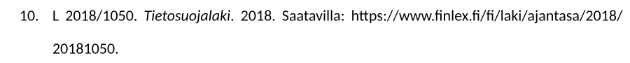

??? info "BibLaTeX entry"

    ```bibtex
    @legislation{lakiTietosuojalaki2018,
        author = {{L 2018/1050}},
        title = {Tietosuojalaki},
        date = {2018},
        url = {https://www.finlex.fi/fi/laki/ajantasa/2018/20181050}
    }
    ```

### 11. Standardi

Zoteron lähdetyyppi: **Report**

Standardin tunniste tallennetaan esimerkin mukaisesti tekijäksi.

| BibLaTeX-kenttä | Esimerkkiarvo                                                          | Kentän nimi Zoterossa |
| --------------- | ---------------------------------------------------------------------- | --------------------- |
| `author`        | `SFS-ISO 21502`                                                        | Author                |
| `title`         | `Projektin-, ohjelman- ja salkunhallinta. Ohjeita projektinhallintaan` | Title                 |
| `publisher`     | `Suomen standardisoimisliitto`                                         | Institution           |
| `date`          | `2021`                                                                 | Date                  |
| `url` (opt)     | `https://online.sfs.fi`                                                | URL                   |

Lähdeluettelossa se näyttää tältä:

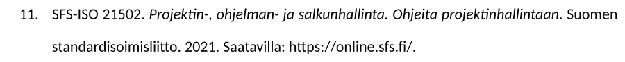

### 12. Tilasto tai tietoaineisto

Zoteron lähdetyyppi: **Dataset**

Tilastot ja tietoaineistot tallennetaan BibLaTeX-tiedostoon aineistolajilla `dataset`.

Lisää aineistolajia kuvaava merkintä, kuten `[Tilasto]` tai `[Tietoaineisto]`, lähteen `title`-kenttään. Nykyinen CSL-tyyli ei lisää merkintää automaattisesti.

`note`-kentässä voidaan ilmoittaa esimerkiksi aineistosta valitut muuttujat, tarkasteluvuodet ja alueellinen rajaus. CSL-tyyli sijoittaa huomautuksen lähteen nimen jälkeen ja ennen julkaisu- ja viittausajankohtaa.

| BibLaTeX-kenttä | Esimerkkiarvo                                                                                                   | Kentän nimi Zoterossa |
| --------------- | --------------------------------------------------------------------------------------------------------------- | --------------------- |
| `author`        | `Tilastokeskus`                                                                                                 | Creator               |
| `title`         | `Hotellien kuukausittainen kapasiteetti ja yöpymiset kunnittain [Tilasto]`                                      | Title                 |
| `date`          | `2020`                                                                                                          | Date                  |
| `note` (opt)    | `Valitut muuttujat: kotimaiset yöpymiset, ulkomaiset yöpymiset, 2021–2022, Kuopio`                              | Notes                 |
| `url`           | `https://statfin.stat.fi/PxWeb/pxweb/fi/StatFin/StatFin__matk/statfin_matk_pxt_11lm.px/table/tableViewLayout1/` | URL                   |
| `urldate`       | `2023-09-19`                                                                                                    | Accessed              |

Lähdeluettelossa se näyttää tältä:

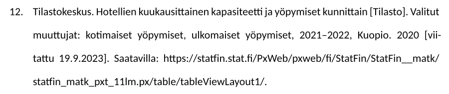

??? info "BibLaTeX-merkintä"

    ```bibtex
    @dataset{tilastokeskusHotellien2020,
      author = {{Tilastokeskus}},
      title = {Hotellien kuukausittainen kapasiteetti ja yöpymiset kunnittain [Tilasto]},
      note = {Valitut muuttujat: kotimaiset yöpymiset, ulkomaiset yöpymiset, 2021–2022, Kuopio},
      date = {2020},
      urldate = {2023-09-19},
      url = {https://statfin.stat.fi/PxWeb/pxweb/fi/StatFin/StatFin__matk/statfin_matk_pxt_11lm.px/table/tableViewLayout1/}
    }
    ```

### 13. Luentotallenne

Zoteron lähdetyyppi: **Web Page**

| BibLaTeX-kenttä | Esimerkkiarvo                    | Kentän nimi Zoterossa |
| --------------- | -------------------------------- | --------------------- |
| `author`        | `Jokinen, R.`                    | Author                |
| `title`         | `Tiedonhaun keskeiset käsitteet` | Title                 |
| `medium`        | `Luentotallenne`                 |                       |
| `publisher`     | `Kajaanin ammattikorkeakoulu`    | Publisher             |
| `date`          | `2017-12-23`                     | Date                  |

Lähdeluettelossa se näyttää tältä:

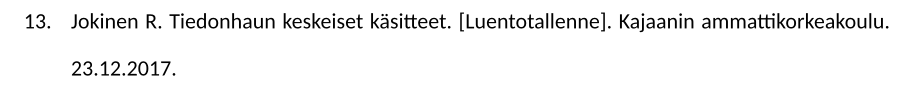

??? info "BibLaTeX entry"

    ```bibtex
    @online{jokinenLuento2017,
        author = {Jokinen, R.},
        title = {Tiedonhaun keskeiset käsitteet. [Luentotallenne]},
        publisher = {Kajaanin ammattikorkeakoulu},
        date = {2017-12-23}
    }
    ```

### 14. Webinaari tai YouTube-video

Zoteron lähdetyyppi: **Web Page**

Huomaa `publisher`-kentän merkitys. KAMK:n Vancouver-ohjeistuksessa on jostain syystä määrätty, että julkaisijan perään tulee lisätä alustan nimi. Muutoin tämä on tavallinen `@online`-lähde. Title-kenttään on tuttuun tapaan ynnätty medium hakasulkeisiin.

| BibLaTeX-kenttä | Esimerkkiarvo                                                    | Kentän nimi Zoterossa |
| --------------- | ---------------------------------------------------------------- | --------------------- |
| `author`        | `Jäntti, M.`                                                     | Author                |
| `title`         | `Digital Afternoon: Digital solutions for forestry. [Webinaari]` | Title                 |
| `publisher`     | `KAMK. Youtube`                                                  | Publisher             |
| `date`          | `2022`                                                           | Date                  |
| `url`           | `https://youtu.be/taOnGdayYqg`                                   | URL                   |
| `urldate`       | `2023-09-19`                                                     | Accessed              |

Lähdeluettelossa se näyttää tältä:

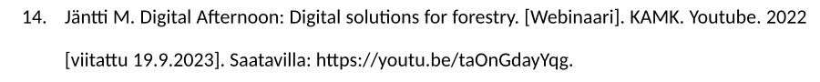

??? info "BibLaTeX entry"

    ```bibtex
    @online{janttiWebinaari2022,
        author = {Jäntti, M.},
        title = {Digital Afternoon: Digital solutions for forestry. [Webinaari]},
        publisher = {KAMK. Youtube},
        date = {2022},
        urldate = {2023-09-19},
        url = {https://youtu.be/taOnGdayYqg}
    }
    ```

### 15. Sähköposti tai henkilökohtainen tiedonanto

Zoteron lähdetyyppi: **Web Page**

Tämän sähköpostin (tai puhelun tai muun haastattelun) osalta on tehty pieni temppu, ja sitä käsitellään aivan kuin verkkosivustoa, jonka puuttuu URL. Aineistolaji voidaan sisällyttää otsikkoon hakasulkeissa, kuten aiemmin. Huomaa, että aineistolaji voi olla esim. puhelinkeskustelu, kirja, sähköposti, haastattelu.

| BibLaTeX-kenttä | Esimerkkiarvo                         | Kentän nimi Zoterossa |
| --------------- | ------------------------------------- | --------------------- |
| `author`        | `Alasalmi, K.`                        | Author                |
| `title`         | `Erikoissairaanhoitaja. [Sähköposti]` | Title                 |
| `date`          | `2018-08-01`                          | Date                  |

Lähdeluettelossa se näyttää tältä:

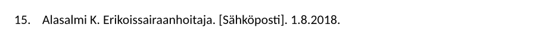

??? info "BibLaTeX entry"

    ```bibtex
    @online{alasalmiSahkoposti2018,
        author = {Alasalmi, K.},
        title = {Erikoissairaanhoitaja. [Sähköposti]},
        date = {2018-08-01}
    }
    ```

### 16. Podcast

Zoteron lähdetyyppi: **Web Page**

Podcast on käytännössä sama kuin YouTube-video yllä.

| BibLaTeX-kenttä | Esimerkkiarvo                                            | Kentän nimi Zoterossa |
| --------------- | -------------------------------------------------------- | --------------------- |
| `author`        | `Lundberg, T.`                                           | Author                |
| `title`         | `Hyvät tunnetaidot auttavat lasta ja aikuista elämässä!` | Title                 |
| `medium`        | `Podcast`                                                |                       |
| `publisher`     | `Tiina Lundbergin huoltamo. Yle Areena`                  | Publisher             |
| `date`          | `2023-09-03`                                             | Date                  |
| `url`           | `https://areena.yle.fi/podcastit/1-50254226`             | URL                   |
| `urldate`       | `2023-01-04`                                             | Accessed              |

Lähdeluettelossa se näyttää tältä:

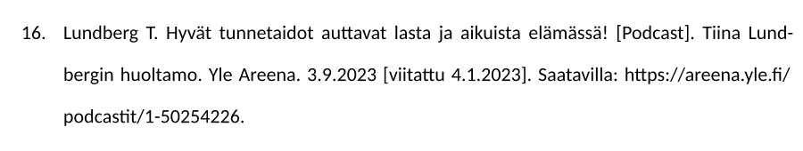

??? info "BibLaTeX entry"

    ```bibtex
    @online{lundbergPodcast2023,
        author = {Lundberg, T.},
        title = {Hyvät tunnetaidot auttavat lasta ja aikuista elämässä! [Podcast]},
        publisher = {Tiina Lundbergin huoltamo. Yle Areena},
        date = {2023-09-03},
        urldate = {2023-01-04},
        url = {https://areena.yle.fi/podcastit/1-50254226}
    }
    ```

### 17. Sosiaalisen median julkaisu

Zoteron lähdetyyppi: **Web Page**

| BibLaTeX-kenttä | Esimerkkiarvo                                                                      | Kentän nimi Zoterossa |
| --------------- | ---------------------------------------------------------------------------------- | --------------------- |
| `author`        | `Nasa`                                                                             | Author                |
| `title`         | `We found “buried treasure,” and the Cosmic Cliffs mark the spot [Instagram-kuva]` | Title                 |
| `publisher`     | `Instagram`                                                                        | Publisher             |
| `date`          | `2022-12-15`                                                                       | Date                  |
| `url`           | `https://www.instagram.com/p/CmMXtU7up-R/`                                         | URL                   |
| `urldate`       | `2023-01-04`                                                                       | Accessed              |

Lähdeluettelossa se näyttää tältä:

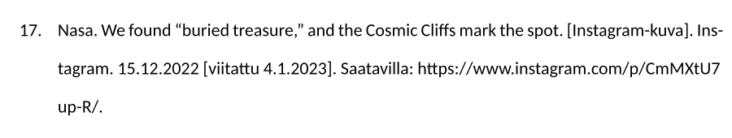

??? info "BibLaTeX entry"

    ```bibtex
    @online{nasaInstagram2022,
        author = {{Nasa}},
        title = {We found “buried treasure,” and the Cosmic Cliffs mark the spot. [Instagram-kuva]},
        publisher = {Instagram},
        date = {2022-12-15},
        urldate = {2023-01-04},
        url = {https://www.instagram.com/p/CmMXtU7up-R/}
    }
    ```

### 18. Peli

Zoteron lähdetyyppi: **Web Page**

URL ja `urldate` lisätään, jos peli on avoimesti saatavilla verkossa. Jos peli on saatavilla esimerkiksi vain Steam-palvelusta, kentät jätetään pois.

| BibLaTeX-kenttä | Esimerkkiarvo                 | Kentän nimi Zoterossa |
| --------------- | ----------------------------- | --------------------- |
| `author`        | `Vollmer, A.; Wohlwend, G.`   | Author                |
| `title`         | `Threes. [Mobiilipeli]`       | Title                 |
| `publisher`     | `Sirvo`                       | Publisher             |
| `date`          | `2014`                        | Date                  |
| `url` (opt)     | `http://play.threesgame.com/` | URL                   |
| `urldate` (opt) | `2023-10-24`                  | Accessed              |

Lähdeluettelossa se näyttää tältä:

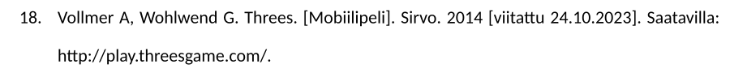

??? info "BibLaTeX entry"

    ```bibtex
    @online{vollmerThrees2014,
        author = {Vollmer, A. and Wohlwend, G.},
        title = {Threes. [Mobiilipeli]},
        publisher = {Sirvo},
        date = {2014},
        urldate = {2023-10-24},
        url = {http://play.threesgame.com/}
    }
    ```

### 19. Poikkeuksellinen lähde (Fallback)

Zoteron lähdetyyppi: **Presentation**

Tätä tulee käyttää vain hätätapauksissa, kun käsissäsi on jokin aivan poikkeuksellinen lähde, johon koko lähdeviite on helpointa kirjoittaa käsin. Kenties tällainen lähde voi olla vaikkapa Bluray-elokuvan ekstroista löytyvä dokumenttiteos, tai jokin muu aivan poikkeuksellinen lähde, johon on kuitenkin jostain syystä perustellista viitata. Tällöin **koko lähdeviite** kirjoitetaan `title`-kenttään, ja muut kentät jätetään tyhjiksi. Zotero ei lisää tähän mitään automaattisesti.

| BibLaTeX-kenttä | Pakollisuus | Esimerkkiarvo                                                                                       | Kentän nimi Zoterossa |
| --------------- | ----------- | --------------------------------------------------------------------------------------------------- | --------------------- |
| `title`         | Pakollinen  | `Mäkinen M. Jotain täysin mahdotonta [Erikoislähde]. Kajaani; 2024. Saatavilla: https://kajaani.fi` | Title                 |

Lähdeluettelossa se näyttää tältä:

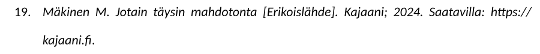

!!! warning

    Huomaa, että yllä oleva esimerkki ei edusta oikeasti mahdotonta lähdettä. Kyseinen lähde olisi täysin tehtävissä yllä mainittujen lähdetyyppien mukaisesti. Älä käytä tätä tavallisten kirjojen, nettisivujen, artikkeleiden tai muiden tavallisten lähteiden kanssa. Tämä on tarkoitettu **niihin poikkeuksellisiin** lähteisiin, jotka eivät kertakaikkiaan millään tavalla edusta mitään muuta lähdetyyppiä.

??? info "BibLaTeX entry"

    ```bibtex
    @unpublished{failsafeFallback,
        title = {Mäkinen M. Jotain täysin mahdotonta [Erikoislähde]. Kajaani; 2024. Saatavilla: https://kajaani.fi}
    }
    ```

## Omat lisäykset

Alla on muutama KAMK:n kirjaston dokumentaatiosta puuttuvaa lähdetyyppiä, jotka ovat tietojenkäsittelyn opiskelijalle tavallisia luku- ja viittauskohteita. Niiden käsittely on kuvattu alla.

### 20. Esijulkaisu tai arXiv-julkaisu

Zoteron lähdetyyppi: **Web Page**

Ensimmäinen esitelty lähdetyyppi on arXiv-artikkeli. Se käsitellään yleisenä digitaalisena lähteenä. Huomaa, että ArXiV-artikkeli voi olla julkaistu tai julkaisematon. Esimerkiksi alla esitelty Attention is All You Need -artikkelia ei tietääkseni ole julkaistu missään tieteellisessä lehdessä (engl. journal), mutta se on julkaistu NeurIPS-konferenssipaperina 2017. Jos sinun käyttämäsi lähde on kuitenkin ladattu ArXiV:stä, missä voi olla saman artikkelin pre-print versio, tai esimerkiksi konferenssin jälkeen julkaistu päivitetty versio, viittaa juuri siihen mitä käytit. Tässä tapauksessa on viitattu nimenomaan versioon v7.

| BibLaTeX-kenttä | Pakollisuus                | Esimerkkiarvo                                                                                                                      | Kentän nimi Zoterossa |
| --------------- | -------------------------- | ---------------------------------------------------------------------------------------------------------------------------------- | --------------------- |
| `author`        | Pakollinen                 | `Vaswani, Ashish; Shazeer, Noam; Parmar, Niki; Uszkoreit, Jakob; Jones, Llion; Gomez, Aidan N.; Kaiser, Lukasz; Polosukhin, Illia` | Author                |
| `title`         | Pakollinen                 | `Attention Is All You Need`                                                                                                        | Title                 |
| `date`          | Pakollinen                 | `2023-08-02`                                                                                                                       | Date                  |
| `url`           | Pakollinen                 | `https://arxiv.org/abs/1706.03762v7`                                                                                               | URL                   |
| `urldate`       | Pakollinen verkkolähteelle | `2026-09-07`                                                                                                                       | Accessed              |

Lähdeluettelossa se näyttää tältä:

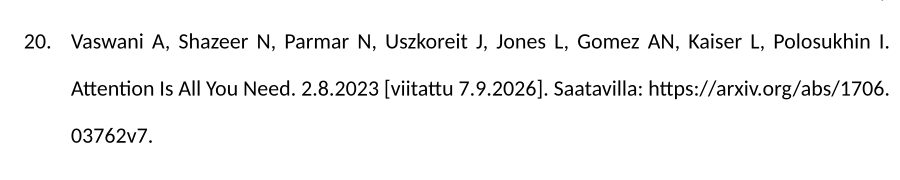

??? info "BibLaTeX entry"

    ```bibtex
    @online{vaswaniAttentionAllYou2023,
        title = {Attention {{Is All You Need}}},
        author = {Vaswani, Ashish and Shazeer, Noam and Parmar, Niki and Uszkoreit, Jakob and Jones, Llion and Gomez, Aidan N. and Kaiser, Lukasz and Polosukhin, Illia},
        date = {2023-08-02},
        url = {https://arxiv.org/abs/1706.03762v7},
        urldate = {2026-09-07},
        abstract = {The dominant sequence ....},
        pubstate = {prepublished},
        keywords = {Computer Science - Computation and Language,Computer Science - Machine Learning}
    }
    ```

!!! tip "Miksi ArXiV:ssä on mediana `@misc`"

    Jos käytät ArXiV:n omaa **Export BibTeX Citation**-toimintoa, se tuottaa BibTeX-merkinnän, jonka mediana on `@misc`. Tämä liittyy siihen, että BibTeX ja BibLaTeX ovat eri formaatteja. BibLaTeX on uudempi ja monipuolisempi, ja se tukee esimerkiksi `@online`-lähdetyyppiä. Yllä oleva esimerkki on luotu liittämällä ArXiV:stä DOI-arvo Zoteroon; Zotero on tunnistanut sen suoraan `@online`-lähteeksi. Vaihtoehtoisesti voisit käyttää ArXiV:n omaa BibTeX-merkintää ja päivittää mediatyypin käsin Zoterossa.

### 21. Verkkopalvelussa luettava e-kirja

Zoteron lähdetyyppi: **Book**

Verkkopalvelussa luettava e-kirja käsitellään kirjana.

| BibLaTeX-kenttä | Esimerkkiarvo                                                              | Kentän nimi Zoterossa |
| --------------- | -------------------------------------------------------------------------- | --------------------- |
| `author`        | `Gutman, Alex J.; Goldmeier, Jordan`                                       | Author                |
| `title`         | `Becoming a Data Head`                                                     | Title                 |
| `date`          | `2021`                                                                     | Date                  |
| `publisher`     | `Wiley`                                                                    | Publisher             |
| `edition` (opt) | `1st edition`                                                              | Edition               |
| `url`           | `https://learning.oreilly.com/library/view/becoming-a-data/9781119741749/` | URL                   |

Lähdeluettelossa se näyttää tältä:

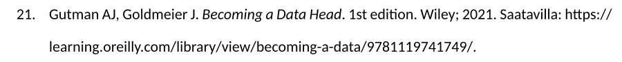

??? info "BibLaTeX entry"

    ```bibtex
        @book{gutmanBecomingDataHead2021,
        title = {Becoming a {{Data Head}}},
        author = {Gutman, Alex J. and Goldmeier, Jordan},
        namea = {{Safari, an O'Reilly Media Company}},
        nameatype = {collaborator},
        date = {2021},
        edition = {1st edition},
        publisher = {Wiley},
        url = {https://learning.oreilly.com/library/view/becoming-a-data/9781119741749/},
        abstract = {Turn yourself into a Data Head...},
        isbn = {978-1-119-74174-9},
        langid = {english}
    }
    ```

### 22. Konferenssijulkaisu

Zoteron lähdetyyppi: **Conference Paper**

Erityisesti tietojenkäsittelytieteissä konferenssijulkaisut ovat merkittävä uuden tiedon lähde. Kyseessä on siis jossakin alan konferenssissa, mieluiten maineikkaassa sellaisessa, esitelty uusi tutkimus. Siihen liittyy ainakin kaksi arfefaktia: **poster** ja **conferenfe paper**. Poster on konferenssissa esitelty juliste, ja conference paper on konferenssin proceedings-kirjaan painettu artikkeli. Media on BibLaTeXissa `@inproceedings` eli siis.. _"a conference paper in proceedings"_.

Jos tutkisit esimerkiksi selitettävää AI:ta ja SHAP-menetelmää, saattaisit törmätä NeurIPS 2025 konferenssin `proceedings.neurips.cc`-sivustolta löytyvään julkaisujen kokoelmaan. Yksi näistä on otsikoltaan _"SHAP Meets Tensor Networks: Provably Tractable Explanations with Parallelism"_. Käyttäkäämme sitä esimerkkinä. Sen Bibtex-merkintä on ladattavissa suoraan [konferenssin sivuilta](https://proceedings.neurips.cc/paper_files/paper/2025/hash/2b11f497dd931bbe14501ff39c48047b-Abstract-Conference.html).

| BibLaTeX-kenttä | Esimerkkiarvo                                                                  | Kentän nimi Zoterossa |
| --------------- | ------------------------------------------------------------------------------ | --------------------- |
| `author`        | `Marzouk, Reda; Bassan, Shahaf; Katz, Guy`                                     | Author                |
| `title`         | `SHAP Meets Tensor Networks: Provably Tractable Explanations with Parallelism` | Title                 |
| `booktitle`     | `Advances in Neural Information Processing Systems`                            | Book Title            |
| `editor`        | `D. Belgrave; C. Zhang; H. Lin; R. Pascanu; P. Koniusz; M. Ghassemi; N. Chen`  | Editor                |
| `publisher`     | `Curran Associates, Inc.`                                                      | Publisher             |
| `date`          | `2025`                                                                         | Date                  |
| `pages`         | `29973--30016`                                                                 | Pages                 |
| `volume`        | `38, Main Conference`                                                          |

Lähdeluettelossa se näyttää tältä:

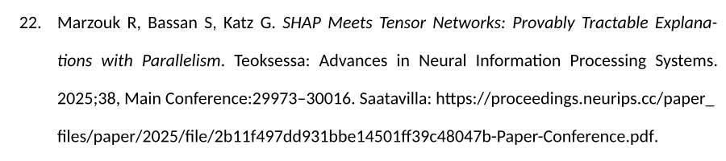

??? info "BibLaTeX entry"

    ```bibtex
    @inproceedings{NEURIPS2025_2b11f497,
        author = {Marzouk, Reda and Bassan, Shahaf and Katz, Guy},
        booktitle = {Advances in Neural Information Processing Systems},
        doi = {10.52202/085713-1006},
        editor = {D. Belgrave and C. Zhang and H. Lin and R. Pascanu and P. Koniusz and M. Ghassemi and N. Chen},
        pages = {29973--30016},
        publisher = {Curran Associates, Inc.},
        title = {SHAP Meets Tensor Networks: Provably Tractable Explanations with Parallelism},
        url = {https://proceedings.neurips.cc/paper_files/paper/2025/file/2b11f497dd931bbe14501ff39c48047b-Paper-Conference.pdf},
        volume = {38, Main Conference},
        year = {2025}
    }
    ```

### 23. Tavallinen lehtiartikkeli

Ei ole kummallinen tämä lähde. Kyseessä on aivan tavallisen painetun lehden, kuten Tekniikan Maailman tai Tiede Luonto lehden artikkeli. Lähteet eivät ole akateemisia lähteitä, mutta niiden käsittely voi olla silti perusteltua tietyissä tilanteissa. Lähteenä tätä käsitellään aivan samoin kuin aiemmin mainittua tieteellistä artikkelia. Volume on suomeksi vuosikerta ja se löytyy yleensä lehden mediakortista, joka on Tiede Luonto -lehdessä sisällysluettelon kanssa samalla aukeamalla.

| BibLaTeX-kenttä | Esimerkkiarvo    | Kentän nimi Zoterossa |
| --------------- | ---------------- | --------------------- |
| `author`        | `Sievinen, Anna` |
| `title`         | `Viisas veijari` | Title                 |
| `date`          | `2026`           | Date                  |
| `journaltitle`  | `Tiede Luonto`   | Publication           |
| `number`        | `2`              | Issue                 |
| `pages`         | `10–17`          | Pages                 |
| `volume`        | `7`              | Volume                |

Lähdeluettelossa se näyttää tältä:

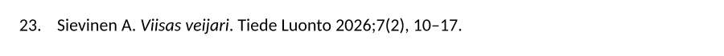

??? info "BibLaTeX entry"

    ```bibtex
    @article{sievinenViisasVeijari2026,
        author = {Sievinen, Anna},
        title = {Viisas veijari},
        journaltitle = {Tiede Luonto},
        date = {2026},
        number = {2},
        pages = {10--17},
        volume = {7},
        issn = {2669-8390},
    }
    ```
